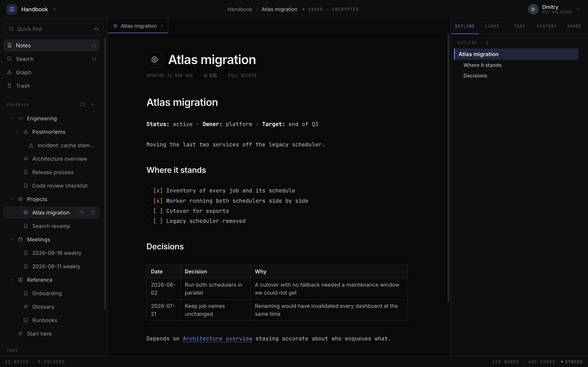
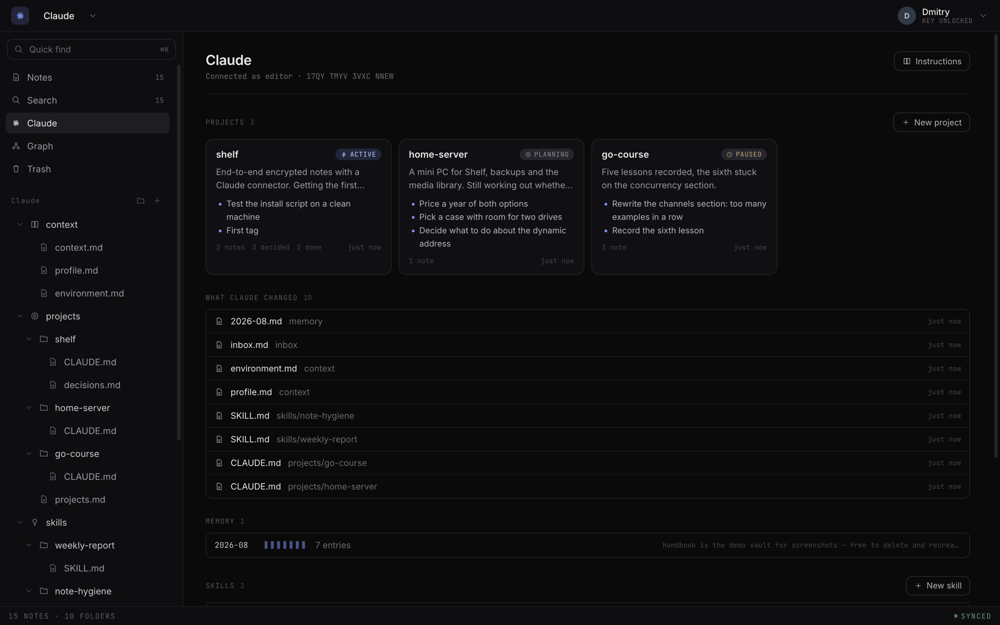
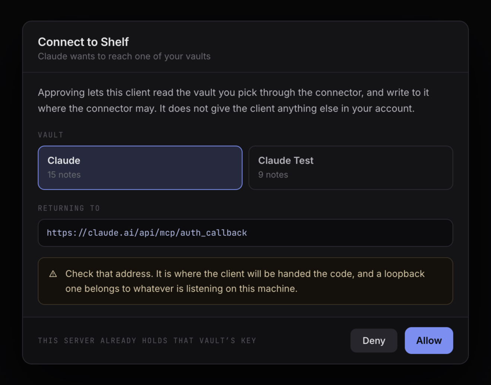
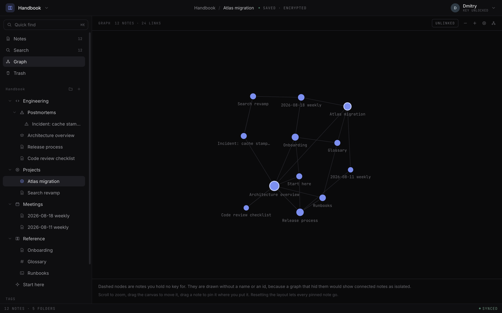

<div align="center">


# Shelf

**End-to-end encrypted notes you host yourself — and that Claude can read.**

The server stores nothing but ciphertext, the keys stay in the browser,
and Claude joins a vault over MCP as an ordinary member.

[](LICENSE)
[](go.mod)
[](web/package.json)
[](migrations)
[](#claude-as-a-member-of-a-vault)
[](#what-the-server-knows-and-what-it-does-not)

[Quick start](#quick-start) ·
[Claude](#claude-as-a-member-of-a-vault) ·
[Privacy](#what-the-server-knows-and-what-it-does-not) ·
[Features](#features) ·
[Documentation](#documentation)

[Русский](README.ru.md) · **English**

</div>

<p align="center">
  
</p>

---

## What this is

Shelf is a note service you run on your own server: Markdown, folders, tags, wikilinks, a
link graph, live collaborative editing, revision history, a trash bin, public links, export
and import. The backend is Go, the frontend is embedded in the single binary, and the data
lives in PostgreSQL.

Two things set it apart from other note services.

**Content is encrypted in the browser.** Titles, note bodies and folder names reach the
server already encrypted and are decrypted only on the device. The key is derived from your
passphrase and never gets to the server, so an administrator with a database dump has
ciphertext, sizes and timestamps, but not the text.

**Claude joins as a member of a vault.** Not as a plugin, and not by pasting text into a
chat: the connector has a key of its own, a role in the vault, and a signature in the edit
history. It reads and writes notes itself — keeping projects, logging decisions, remembering
context between sessions. Access is revoked by removing the member, the same way it is for a
person.

The second feature has a price worth knowing up front: **a vault with a connector is
readable by the server.** The model reaches it from Anthropic's network, so decryption
happens on the server and there is no way around it. That is why the connector is enabled
for one vault, at the owner's explicit request, and shows up in the member list. The server
holds no key to your other vaults and has no way to obtain one.

## Who it is for

- **A personal knowledge base** you would rather not hand to somebody else's SaaS: notes, a
  journal, an archive, work material under NDA.
- **Shared memory for Claude between sessions** — projects, decisions, skills, facts about
  you and your setup. It sits on your server in a readable format, and you can open it, edit
  it by hand and take it away as a zip.
- **A small team** with roles, groups and invitations, where granting access and handing over
  a key are one action rather than two.

## Quick start

### On your own server — one command

A fresh Debian or Ubuntu machine whose domain already points at it:

```bash
curl -fsSL https://raw.githubusercontent.com/murygin-ds/shelf/main/install.sh \
  | sudo bash -s -- --domain notes.example.com --email you@example.com
```

The script checks the machine, installs Docker, builds the image, starts PostgreSQL and the
service behind Caddy, and waits until the domain answers over a certificate Let's Encrypt has
just issued. Given both flags it asks nothing.

The domain is needed because keys are derived through WebCrypto, which a browser does not
offer to a page served over plain HTTP.

The script makes no network call its flags do not name, so reading it first is easy enough:
[install.sh](install.sh), details in [docs/deploy.md](docs/deploy.md).

### Locally — for development

```bash
make env         # .env from .env.example
make db-up       # PostgreSQL 17 in docker
make migrate-up  # apply the migrations
make web         # build the frontend
make run         # start the service on :8080
```

The first account is made by whoever opens `/signup` first. There is no separate
administrator: roles exist inside a vault, not above one.

## Claude as a member of a vault

<p align="center">
  
</p>

### Connecting

In Claude Code it is one command:

```bash
claude mcp add --transport http shelf https://notes.example.com/api/v1/mcp
```

In Claude Desktop and on the web it is "Add connector" and the same address. A consent screen
follows, where you choose which vault the access covers and confirm it. Authorisation runs on
OAuth 2.1 with PKCE and single-use refresh tokens, so there are no API keys to handle by hand.

<p align="center">
  
  
</p>

A wizard in the interface walks through the steps and, if there is no suitable vault yet,
creates one from a ready template.

### What Claude can do

Thirteen tools over Streamable HTTP:

| Group        | Tools                                                                          |
|--------------|--------------------------------------------------------------------------------|
| Reading      | `shelf_list_tree`, `shelf_read_note`, `shelf_search_notes`                      |
| Writing      | `shelf_create_note`, `shelf_write_note`, `shelf_append_note`                    |
| Organising   | `shelf_create_folder`, `shelf_move_note`, `shelf_set_meta`                      |
| Trash        | `shelf_trash_note`, `shelf_trash_folder`, `shelf_list_trash`, `shelf_restore`   |

Search narrows by folder, by tag, or by both at once. Permanent deletion is not among the
tools: the bin is reversible, and there is no reason for a model to destroy ciphertext that
nothing brings back.

A connector admitted as a viewer is not shown the writing tools at all — otherwise the model
would keep trying calls that are refused anyway.

### What it will not do

- **Overwrite somebody else's edit.** A write quoting a stale `content_seq` is refused,
  because merging two ciphertexts on the server is impossible.
- **Write into a note somebody has open.** If the note is being edited in a browser right
  now, the write is refused. A note with unsaved edits carries a `pending_edits` mark that
  travels in every answer, so the model reads the body knowing it is not all there is.
- **See what has been closed to it.** Denying it a folder is an ordinary permission row, the
  same one that hides a folder from a person.

### A vault as an operating system for Claude

An empty connector is of little use: a model asked to remember something needs somewhere to
keep it. So a new Claude vault is created with a tree already in it — context (who you are,
what you work on, what your setup is), projects with statuses and decision logs, skills,
month-by-month memory, and an inbox.

Such a vault gets a view of its own in the interface, next to notes and the graph. A tree
answers the question of which files exist, while what people usually want from a vault used
as a model's memory is different: which projects are moving, what was decided, what the model
wrote since last time, and which of the standing facts are still blank. The view assembles
that from the already-decrypted tree in the tab and asks the server for nothing extra.

### Disconnecting

The connector is built as an account with a membership rather than as a mechanism of its own.
Everything else follows from that:

- removing the member revokes access and every key at every version, and marks the vault for
  rotation;
- key rotation picks the connector up on its own, because it is among the holders of the
  current key;
- what it wrote is signed with its key and stays in the history, so its authorship is
  visible.

## What the server knows, and what it does not

<p align="center">
  
</p>

The passphrase goes through Argon2id and yields 64 bytes. The first half goes to the server
as a verifier, the second stays on the device and wraps the master key, so what the server
stores does not yield the second half.

Under the master key sits a pair of keypairs: ECDH to receive keys, ECDSA to sign what you
write. Content keys belong to a scope — a vault, a folder or a single note — and are sealed to
each member separately. Every ciphertext is bound to its slot, so moving one note's body onto
another is not something even the server can do.

| The server knows                                       | The server does not know                    |
|--------------------------------------------------------|---------------------------------------------|
| The shape of the tree: how many folders and notes, and which contains which | Note titles            |
| Sizes, to a 4 KiB granularity                          | Note bodies                                 |
| Every timestamp: created, changed, read                | Folder names, icons, tags                   |
| Who changed what                                       | Search queries                              |
| Members, roles, and every change to them               | The private label a member keeps on a vault |
| The link graph — which note references which           | The text of links that resolved to nothing  |
| Login times and IP addresses                           | The passphrase and the master key           |

The full model — including what is visible during a live editing session, and the caveats
about the graph and public links — is in [docs/security.md](docs/security.md).

The connector is the exception. A vault with Claude attached is readable by the server in
full: folder names, titles and bodies. The interface says so when it is connected, and so
does the vault's own root document. No other vault is affected.

## Features

**Notes.** Markdown with a live preview, tables, checklists, code blocks. Wikilinks
`[[path]]` and `[[Title]]`, backlinks, an outline built from the headings. Icons and tags.
Full-text search over an index that is built in the tab and dies with it.

**Graph.** Every note in the vault as a node, a force layout, neighbour highlighting. Notes
you hold no key for are drawn as grey dashed nodes without a name, so that a note connected
only through them does not look isolated.

<p align="center">
  
</p>

**Collaboration.** Two people can edit one note at the same time: the changes merge through a
CRDT in the browsers themselves, and each sees the other's caret and selection with a name on
it. The server takes no part in the merge, since it cannot read the text — it relays sealed
updates and refuses the ones from somebody without the right to write.

**Permissions.** The vault role sets a floor, a folder narrows it, a note overrides both, and
a grant addressed to a person outranks one reaching them through a group. A group carries a
keypair of its own, so adding a person to a group costs one seal rather than one per folder.
Invitations work by code, and the key is sealed to the code rather than to a person.

**Key rotation.** After a member is removed, the scopes they could read are marked for
re-encryption. Rotation runs as a resumable job rather than a single request: if a tab closes
midway, what is left is a staging table rather than a vault half of whose rows are unreadable.

**History and recovery.** Note revisions with author signatures, a trash bin you can restore
from, and public snapshot links — their secret lives in the URL fragment, which browsers do
not send to the server.

**Offline.** The IndexedDB cache holds ciphertext only. A write that meets no network is
sealed and queued. Reloading a tab does not ask for the passphrase; a new tab does.

**Import and export.** A vault leaves as a plain zip — `notes/…/file.md` in the structure the
sidebar shows, plus a manifest — and comes back as a new vault. Both run in the browser, since
it is the only side that holds keys.

**Read-only mode.** A switch for one particular browser: this device stops writing anywhere.
The account keeps every role it had — it is a guard against an accidental edit, not a
restriction of access.

**Two languages.** English and Russian, error messages included.

## Documentation

| Document                                     | About                                                                    |
|----------------------------------------------|--------------------------------------------------------------------------|
| [docs/architecture.md](docs/architecture.md) | Layers, the domain, where things live and why                             |
| [docs/security.md](docs/security.md)         | The encryption model, permissions and keys, rotation, what the server learns |
| [docs/mcp.md](docs/mcp.md)                   | The Claude connector: how it is built, its tools, OAuth, its limits        |
| [docs/deploy.md](docs/deploy.md)             | `install.sh`, configuration, migrations, running it                       |
| [docs/api.md](docs/api.md)                   | Endpoints, the error format, sync, the live editing socket                |
| [SECURITY.md](SECURITY.md)                   | How to report a vulnerability                                             |

Swagger is served by the service itself: `http://localhost:8080/swagger/index.html`.

## Stack

| Layer         | Technology                                                      |
|---------------|------------------------------------------------------------------|
| HTTP          | [gin](https://github.com/gin-gonic/gin)                          |
| Database      | PostgreSQL 17 + [pgx/v5](https://github.com/jackc/pgx)            |
| Frontend      | React 19 + TypeScript + Vite, embedded in the binary              |
| Crypto        | WebCrypto: AES-256-GCM, ECDH P-256, ECDSA P-256, Argon2id         |
| Configuration | [viper](https://github.com/spf13/viper) + `.env`                  |
| Logs          | [zap](https://github.com/uber-go/zap)                             |
| Migrations    | [golang-migrate](https://github.com/golang-migrate/migrate)       |

## Status

The project is young and has not cut a release: there are no tags, and schema compatibility
is not promised. The encryption formats, on the other hand, are frozen — the string binding a
ciphertext to its slot, the CRDT update format and the vectors in `testdata/` cannot change
without making everything already written unreadable.

If you run Shelf for real data, back up the database and `.env`; the install script does not
do it for you.

## Contributing

Patches, bug reports and questions are welcome through issues and pull requests.

Before a PR:

```bash
make check   # fmt + vet + golangci-lint + go test -race
```

One rule matters more than the rest: the server must not be able to read content. If a change
adds code that expects a plaintext title, body, folder name or tag, it is very likely wrong.
The only place plaintext belongs is `internal/mcp`.

## Security

Vulnerabilities go through [SECURITY.md](SECURITY.md). Please do not open a public issue
before we have had a chance to reply.

## License

[MIT](LICENSE).
