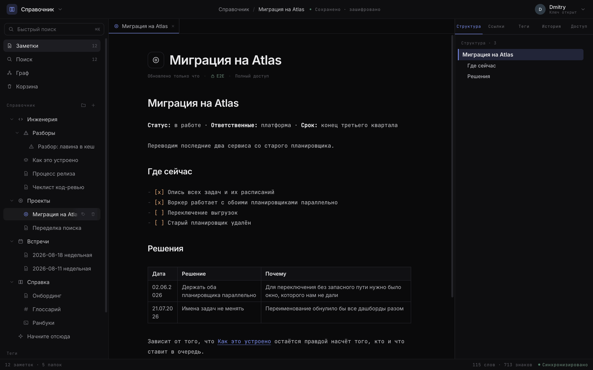
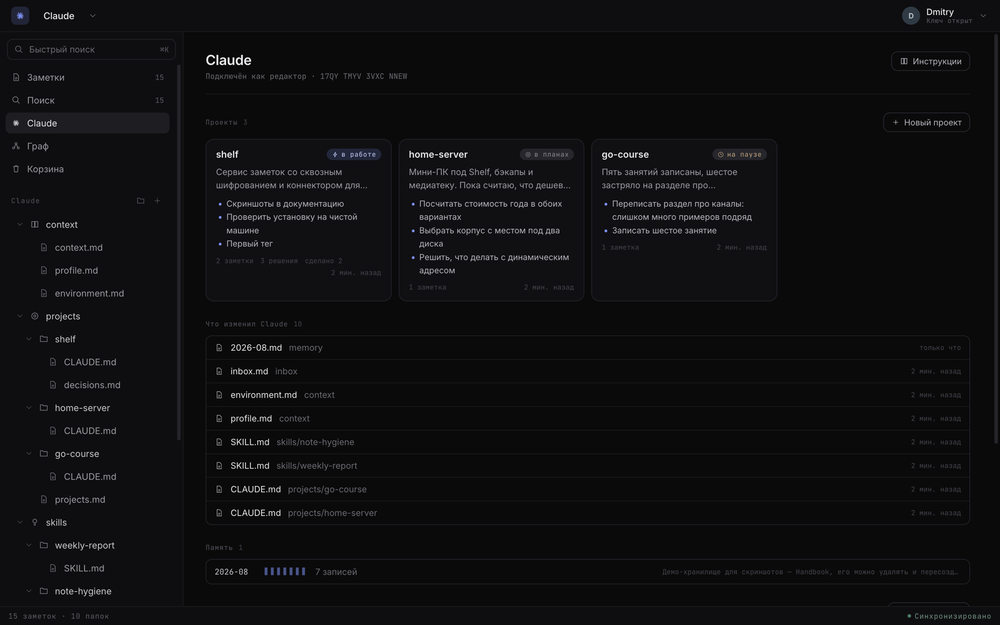
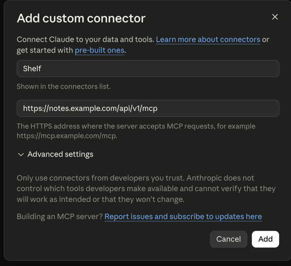
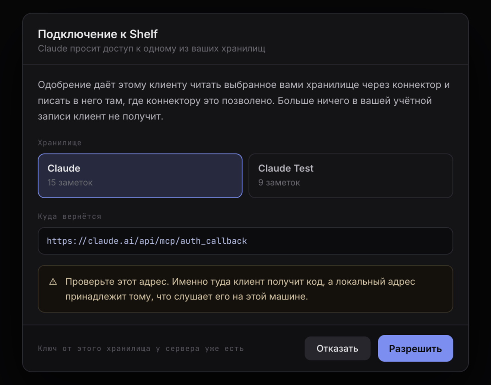
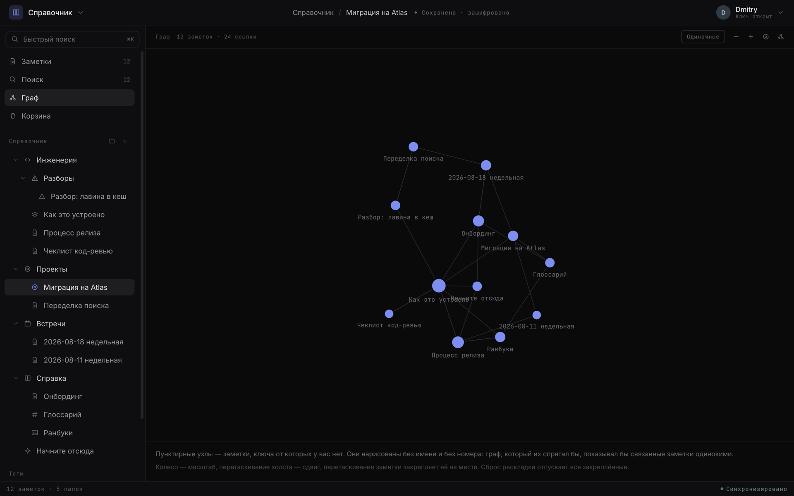

<div align="center">


# Shelf

**Заметки со сквозным шифрованием, которые вы хостите сами — и которые умеет читать Claude.**

Сервер хранит только шифротекст, ключи остаются в браузере,
а Claude подключается к хранилищу по MCP как обычный участник.

[](LICENSE)
[](go.mod)
[](web/package.json)
[](migrations)
[](#claude-как-участник-хранилища)
[](#что-сервер-знает-и-чего-не-знает)

[Быстрый старт](#быстрый-старт) ·
[Claude](#claude-как-участник-хранилища) ·
[Приватность](#что-сервер-знает-и-чего-не-знает) ·
[Возможности](#возможности) ·
[Документация](#документация)

**Русский** · [English](README.md)

</div>

<p align="center">
  
</p>

---

## Что это

Shelf — сервис заметок, который вы поднимаете на своём сервере: Markdown, папки, теги,
вики-ссылки, граф связей, совместное редактирование в реальном времени, история версий,
корзина, публичные ссылки, экспорт и импорт. Бэкенд на Go, фронтенд вшит в один бинарник,
данные — в PostgreSQL.

От других сервисов заметок он отличается двумя вещами.

**Содержимое шифруется в браузере.** Заголовки, тела заметок и имена папок уходят на сервер
уже зашифрованными и расшифровываются только на устройстве. Ключ выводится из парольной
фразы и на сервер не попадает, поэтому у администратора с дампом базы есть шифротекст,
размеры и отметки времени, но не текст.

**Claude подключается как участник хранилища.** Не плагином и не копипастой в чат: у
коннектора есть собственный ключ, роль в хранилище и подпись в истории правок. Он сам читает
и пишет заметки — ведёт проекты, копит решения, помнит контекст между сессиями. Доступ
отзывается удалением участника, так же как у человека.

У второй возможности есть цена, о которой лучше знать заранее: **хранилище, к которому
подключён Claude, сервер читает.** Модель обращается к нему из сети Anthropic, так что
расшифровка происходит на сервере, и обойти это нельзя. Поэтому коннектор включается на одно
хранилище, по явной просьбе владельца, и виден в списке участников. К остальным хранилищам у
сервера ключей нет и получить их неоткуда.

## Кому это нужно

- **Личная база знаний**, которую не хочется отдавать чужому SaaS: заметки, дневник, архив,
  рабочие материалы под NDA.
- **Общая память Claude между сессиями** — проекты, решения, скиллы, факты о вас и вашем
  окружении. Она лежит на вашем сервере, в читаемом формате, и её можно открыть глазами,
  отредактировать руками и забрать zip-архивом.
- **Небольшая команда** с ролями, группами и приглашениями, где выдача доступа и выдача
  ключа — одно действие, а не два.

## Быстрый старт

### На своём сервере — одна команда

Свежая Debian или Ubuntu, домен уже указывает на эту машину:

```bash
curl -fsSL https://raw.githubusercontent.com/murygin-ds/shelf/main/install.sh \
  | sudo bash -s -- --domain notes.example.com --email you@example.com
```

Скрипт проверит машину, поставит Docker, соберёт образ, поднимет PostgreSQL и сервис за
Caddy и дождётся, пока домен ответит по сертификату Let's Encrypt. Если оба флага переданы,
вопросов он не задаёт.

Домен нужен потому, что ключи выводятся через WebCrypto, а браузер не даёт его странице,
открытой по обычному HTTP.

Скрипт не делает сетевых вызовов, которых нет в его флагах, так что прочитать его перед
запуском несложно: [install.sh](install.sh), подробности — в
[docs/deploy.md](docs/deploy.md).

### Локально — для разработки

```bash
make env         # .env из .env.example
make db-up       # PostgreSQL 17 в docker
make migrate-up  # применить миграции
make web         # собрать фронтенд
make run         # запустить сервис на :8080
```

Первый аккаунт заводит тот, кто первым откроет `/signup`. Отдельного администратора нет:
роли существуют внутри хранилища, а не над ним.

## Claude как участник хранилища

<p align="center">
  
</p>

### Подключение

В Claude Code — одна команда:

```bash
claude mcp add --transport http shelf https://notes.example.com/api/v1/mcp
```

В Claude Desktop и в вебе — «Добавить коннектор» и тот же адрес. Дальше открывается экран
согласия, где вы выбираете, к какому хранилищу даётся доступ, и подтверждаете. Авторизация
идёт по OAuth 2.1 с PKCE и одноразовыми refresh-токенами, вручную API-ключи заводить не
нужно.

<p align="center">
  
  
</p>

Мастер в интерфейсе проводит по шагам и, если подходящего хранилища ещё нет, создаёт его
сразу с готовым шаблоном.

### Что Claude умеет

Тринадцать инструментов поверх Streamable HTTP:

| Группа        | Инструменты                                                                   |
|---------------|-------------------------------------------------------------------------------|
| Чтение        | `shelf_list_tree`, `shelf_read_note`, `shelf_search_notes`                     |
| Запись        | `shelf_create_note`, `shelf_write_note`, `shelf_append_note`                   |
| Организация   | `shelf_create_folder`, `shelf_move_note`, `shelf_set_meta`                     |
| Корзина       | `shelf_trash_note`, `shelf_trash_folder`, `shelf_list_trash`, `shelf_restore`  |

Поиск сужается папкой, тегом или тем и другим сразу. Безвозвратного удаления среди
инструментов нет: корзина обратима, а уничтожать шифротекст, который ничем не
восстановить, модели незачем.

Коннектору с ролью читателя инструменты записи не показываются вовсе — иначе модель будет
пробовать вызовы, которые всё равно отклоняются.

### Что он не сделает

- **Не перезапишет чужую правку.** Запись с устаревшим `content_seq` отклоняется, потому что
  слить два шифротекста на сервере невозможно.
- **Не влезет в открытую заметку.** Если её сейчас редактируют в браузере, запись
  отклоняется. У заметки с несохранёнными правками стоит пометка `pending_edits`, и она
  приходит в каждом ответе, так что модель читает тело, зная, что видит не всё.
- **Не увидит то, что ему закрыли.** Запрет на папку — обычная строка прав, та же самая,
  которой папку прячут от человека.

### Хранилище как «ОС для Claude»

Пустой коннектор мало полезен: модели, которую просят что-то запомнить, нужно место, где
хранить это. Поэтому новое Claude-хранилище создаётся уже с деревом: контекст (кто вы, чем
занимаетесь, какое у вас окружение), проекты со статусами и журналами решений, скиллы,
помесячная память и входящие.

У такого хранилища есть свой вид в интерфейсе, рядом с заметками и графом. Дерево отвечает
на вопрос, какие есть файлы, а от хранилища для модели обычно хотят знать другое: какие
проекты движутся, что было решено, что модель написала с прошлого раза и какие из постоянных
фактов до сих пор не заполнены. Вид собирает это из уже расшифрованного дерева прямо во
вкладке и ничего дополнительно у сервера не запрашивает.

### Отключение

Коннектор устроен как аккаунт с членством в хранилище, а не как отдельный механизм. Отсюда
следует всё остальное:

- удаление участника отзывает доступ, все ключи всех версий и помечает хранилище на ротацию;
- ротация ключей подхватывает коннектор сама, потому что он в списке держателей ключа;
- написанное им подписано его ключом и остаётся в истории, так что авторство видно.

## Что сервер знает и чего не знает

<p align="center">
  
</p>

Парольная фраза проходит через Argon2id и даёт 64 байта. Первая половина уходит на сервер
как проверочное значение, вторая остаётся на устройстве и оборачивает мастер-ключ, поэтому
из того, что хранит сервер, вторую половину не получить.

Под мастер-ключом лежит пара ключей: ECDH — чтобы получать ключи, ECDSA — чтобы подписывать
написанное. Ключи содержимого принадлежат области (хранилищу, папке или отдельной заметке) и
запечатываются каждому участнику отдельно. Каждый шифротекст привязан к своему месту, так что
подставить тело одной заметки вместо другой не получится даже у сервера.

| Сервер знает                                          | Сервер не знает                                |
|-------------------------------------------------------|------------------------------------------------|
| Форму дерева: сколько папок и заметок, что где лежит   | Заголовки заметок                              |
| Размеры — с точностью до 4 КиБ                        | Тела заметок                                   |
| Все отметки времени: создано, изменено, прочитано      | Имена папок, иконки, теги                      |
| Кто что менял                                         | Поисковые запросы                              |
| Участников, роли и все изменения в них                 | Личную подпись хранилища у участника            |
| Граф ссылок — какая заметка ссылается на какую          | Текст ссылок, которые ни во что не разрешились |
| Время входов и IP-адреса                              | Парольную фразу и мастер-ключ                   |

Полная модель — с тем, что видно во время совместного редактирования, и с оговорками про
граф и публичные ссылки — в [docs/security.md](docs/security.md).

Исключение — коннектор. Хранилище, к которому подключён Claude, сервер читает целиком: имена
папок, заголовки и тела. Об этом предупреждает интерфейс при подключении и корневой документ
самого хранилища. На другие хранилища это не распространяется.

## Возможности

**Заметки.** Markdown с живым предпросмотром, таблицы, чек-листы, блоки кода. Вики-ссылки
`[[путь]]` и `[[Заголовок]]`, обратные ссылки, оглавление по заголовкам. Иконки и теги.
Полнотекстовый поиск по индексу, который собирается во вкладке и умирает вместе с ней.

**Граф.** Все заметки хранилища как узлы, силовая раскладка, подсветка соседей. Заметки, для
которых у вас нет ключа, показываются серыми пунктирными узлами без имени, чтобы связанная
через них заметка не выглядела изолированной.

<p align="center">
  
</p>

**Совместная работа.** Двое могут править одну заметку одновременно: изменения сливаются
CRDT прямо в браузерах, каждый видит чужой курсор и выделение с именем. Сервер в слиянии не
участвует, поскольку не может прочитать текст, — он пересылает запечатанные обновления и
отклоняет пришедшие от того, у кого нет права записи.

**Права.** Роль в хранилище задаёт основу, папка сужает, заметка перекрывает, персональный
доступ старше группового. Группа несёт свою пару ключей, поэтому добавление человека в
группу стоит одного запечатывания, а не одного на каждую папку. Приглашения работают по
коду, и ключ запечатан на код, а не на человека.

**Ротация ключей.** После удаления участника затронутые области помечаются на перешифровку.
Ротация выполняется возобновляемой задачей, а не одним запросом: если вкладка закроется
посреди процесса, останется временная таблица, а не наполовину нечитаемое хранилище.

**История и восстановление.** Версии заметки с подписями авторов, корзина с восстановлением,
публичные ссылки-снимки — секрет от них живёт во фрагменте URL, который браузер серверу не
отправляет.

**Офлайн.** Кеш в IndexedDB хранит только шифротекст. Запись, не нашедшая сети,
запечатывается и ждёт в очереди. Перезагрузка вкладки не спрашивает парольную фразу, новая
вкладка спрашивает.

**Импорт и экспорт.** Хранилище уезжает обычным zip: `notes/…/файл.md` в той же структуре,
что в сайдбаре, плюс манифест. Возвращается новым хранилищем. Обе операции идут в браузере,
поскольку ключи есть только у него.

**Режим только для чтения.** Переключатель для конкретного браузера: это устройство
перестаёт писать куда бы то ни было. Права аккаунта при этом не меняются — это страховка от
случайной правки, а не ограничение доступа.

**Два языка.** Английский и русский, включая все сообщения об ошибках.

## Документация

| Документ                                     | О чём                                                                      |
|----------------------------------------------|----------------------------------------------------------------------------|
| [docs/architecture.md](docs/architecture.md) | Слои, домен, где что лежит и почему именно там                              |
| [docs/security.md](docs/security.md)         | Модель шифрования, права и ключи, ротация, что сервер учится знать           |
| [docs/mcp.md](docs/mcp.md)                   | Коннектор Claude: устройство, инструменты, OAuth, границы                    |
| [docs/deploy.md](docs/deploy.md)             | `install.sh`, конфигурация, миграции, эксплуатация                          |
| [docs/api.md](docs/api.md)                   | Эндпоинты, формат ошибок, синхронизация, сокет живого редактирования         |
| [SECURITY.md](SECURITY.md)                   | Как сообщить об уязвимости                                                  |

Swagger — на самом сервисе: `http://localhost:8080/swagger/index.html`.

## Стек

| Слой          | Технология                                                     |
|---------------|-----------------------------------------------------------------|
| HTTP          | [gin](https://github.com/gin-gonic/gin)                        |
| База          | PostgreSQL 17 + [pgx/v5](https://github.com/jackc/pgx)          |
| Фронтенд      | React 19 + TypeScript + Vite, вшит в бинарник                   |
| Крипта        | WebCrypto: AES-256-GCM, ECDH P-256, ECDSA P-256, Argon2id       |
| Конфигурация  | [viper](https://github.com/spf13/viper) + `.env`                |
| Логи          | [zap](https://github.com/uber-go/zap)                           |
| Миграции      | [golang-migrate](https://github.com/golang-migrate/migrate)     |

## Статус

Проект молодой, релизов пока не было: тегов нет, обратная совместимость схемы не обещана.
Форматы шифрования при этом заморожены — строку привязки шифротекста к месту, формат
CRDT-обновлений и вектора в `testdata/` менять нельзя, иначе всё уже записанное перестанет
читаться.

Если поднимаете Shelf для настоящих данных, делайте бэкапы базы и `.env`: скрипт установки
этим не занимается.

## Вклад

Патчи, баг-репорты и вопросы — через issues и pull requests.

Перед PR:

```bash
make check   # fmt + vet + golangci-lint + go test -race
```

Главное правило: сервер не должен уметь читать содержимое. Если правка добавляет код,
ожидающий открытый заголовок, тело, имя папки или тег, скорее всего она неверна.
Единственное место, где открытый текст допустим, — `internal/mcp`.

## Безопасность

Об уязвимостях — по инструкции в [SECURITY.md](SECURITY.md). Пожалуйста, не открывайте
публичный issue до того, как мы успеем ответить.

## Лицензия

[MIT](LICENSE).
